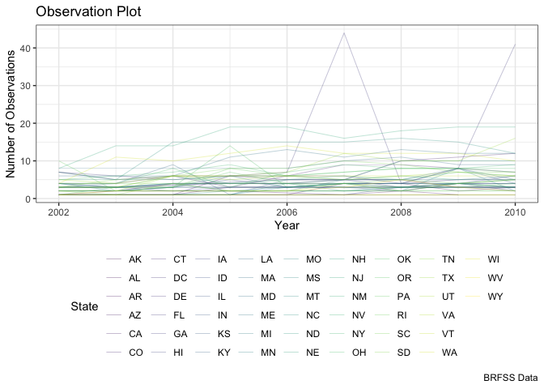
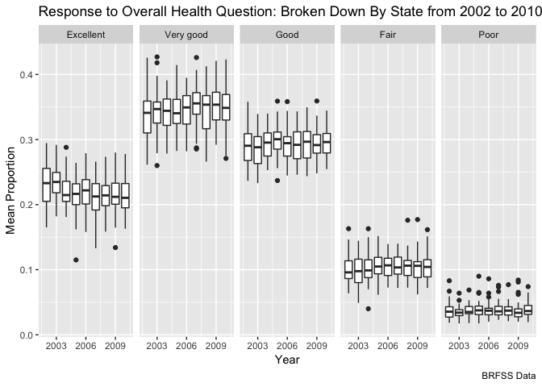

p8105\_hw3\_ak4123
================

Problem 1
=========

Data Cleaning: In this code chunk, I clean the data and focus on the "Overall Health Topic". Also, I include only responses from “Excellent” to “Poor”; also, I organize responses as a factor taking levels ordered from “Excellent” to “Poor”.
------------------------------------------------------------------------------------------------------------------------------------------------------------------------------------------------------------------------------------------------

``` r
library(p8105.datasets)
data("brfss_smart2010")

brfss_data = brfss_smart2010 %>% 
  janitor::clean_names() %>% 
  filter(topic == "Overall Health") %>% 
  filter(response == "Excellent" | response == "Very good" | response == "Good" | response == "Fair" | response == "Poor") %>% mutate(response = ordered(response, levels = c("Excellent", "Very good", "Good", "Fair", "Poor")))
```

Part A:
-------

``` r
brfss_data %>%
  filter(year == 2002) %>% 
  distinct(locationdesc, locationabbr) %>%
  group_by(locationabbr) %>% 
  count() %>% 
  filter(n == 7)
```

    ## # A tibble: 3 x 2
    ## # Groups:   locationabbr [3]
    ##   locationabbr     n
    ##   <chr>        <int>
    ## 1 CT               7
    ## 2 FL               7
    ## 3 NC               7

The states with that were observed at 7 locations in 2002 are: CT, FL, and NC.

Part B: Here, I make a “spaghetti plot” that shows the number of locations in each state from 2002 to 2010.
-----------------------------------------------------------------------------------------------------------

``` r
brfss_data %>% 
  filter(year >= 2002 & year <= 2010) %>% 
  group_by(locationabbr, year) %>%  
  distinct(locationdesc) %>% 
  summarize(location_count = n()) %>%
  ggplot(aes(x = year, y = location_count, color = locationabbr)) +
    geom_line(size = 0.1) +
    labs(
      title = "Observation Plot",
      x = "Year",
      y = "Number of Observations",
      caption = "BRFSS Data"
    ) +
    viridis::scale_color_viridis(
      name = "State",
      discrete = TRUE
    ) + 
  theme_bw() +
    theme(legend.position = "bottom") +
  guides(color = guide_legend(nrow = 6))
```

 \#\#Part C: Here, I make a table showing, for the years 2002, 2006, and 2010, the mean and standard deviation of the proportion of “Excellent” responses across locations in NY State.

``` r
brfss_data %>%
  spread(key = response, value = data_value) %>%
  janitor::clean_names() %>% 
  select(year, excellent, locationabbr) %>% 
  filter(!is.na(excellent) & locationabbr == "NY" & (year == "2002" | year == "2006" | year == "2010")) %>%
  group_by(year) %>% 
  summarize(mean_proportion_excellent = mean(excellent), sd_proportion_excellent = sd(excellent)) %>% 
  knitr::kable()
```

|  year|  mean\_proportion\_excellent|  sd\_proportion\_excellent|
|-----:|----------------------------:|--------------------------:|
|  2002|                     24.04000|                   4.486424|
|  2006|                     22.53333|                   4.000833|
|  2010|                     22.70000|                   3.567212|

Part D: For each year and state, I compute the average proportion in each response category (taking the average across locations in a state). Then, I make a five-panel plot that shows, for each response category separately, the distribution of these state-level averages over time.
-----------------------------------------------------------------------------------------------------------------------------------------------------------------------------------------------------------------------------------------------------------------------------------------

``` r
brfss_data %>% 
  mutate(proportion = data_value / 100) %>% 
  group_by(year, locationabbr, response) %>% 
  summarize(mean_proportion = mean(proportion)) %>% 
  ggplot(aes(x = year, y = mean_proportion, fill = locationabbr)) +
    geom_boxplot(aes(group = cut_width(year,1))) +
    scale_x_continuous(breaks = c(2003, 2006, 2009)) +
    facet_grid(~response) +
    labs(
      title = "Response to Overall Health Question: Broken Down By State from 2002 to 2010",
      x = "Year", 
      y = "Mean Proportion",
      caption = "BRFSS Data"
    )
```

    ## Warning: Removed 21 rows containing non-finite values (stat_boxplot).

 \#Question 2 \#\#Data Cleaning of the instacart dataset.

``` r
library(p8105.datasets)
data("instacart")

instacart = instacart %>% 
janitor::clean_names()
```

The dimensions of this dataset are (1384617, 15). This means there are 1384617 observations (rows) and 15 variables (columns). Some of the key variables include the user identification number, product name (along with an identification number), the department and aisle the product is located in. There is also: "order\_id" "product\_id"
"add\_to\_cart\_order" "reordered"
"user\_id" "eval\_set"
"order\_number" "order\_dow"
"order\_hour\_of\_day" "days\_since\_prior\_order" "product\_name" "aisle\_id"
"department\_id" "aisle"
"department"

An example of an observation would be for the user id 112108, a product they ordered was Bulgarian Yogurt. This product comes from the dairy eggs.

Part A
------

``` r
instacart %>% 
group_by(aisle) %>% 
  count(order_id) %>% 
arrange(desc(n)) %>% 
  head(7) %>% 
  knitr::kable()
```

| aisle               |  order\_id|    n|
|:--------------------|----------:|----:|
| baby food formula   |    2188545|   28|
| energy granola bars |    1385776|   28|
| tea                 |    2445873|   27|
| yogurt              |    2606705|   26|
| cat food care       |    3363902|   24|
| energy granola bars |    2397010|   24|
| baby food formula   |    2070470|   23|

There are 134 aisles. The aisles with the most orders are baby food formula and energy granola bars, each with 28 orders.

Part B: Here, I make a plot that shows the number of items ordered in each aisle.
---------------------------------------------------------------------------------

``` r
instacart %>% 
  group_by(aisle) %>% 
  summarize(amount_ordered = n()) %>% 
  ggplot(aes(x = aisle, y = amount_ordered)) + 
  geom_point() +
  labs(
     title = "Items ordered in each aisle",
     x = "aisle number",
     y = "number of items ordered"
    ) + theme_bw()
```

 \#\#Part C: I make a table showing the most popular item in each of the aisles: “baking ingredients”, “dog food care”, and “packaged vegetables fruits”.

``` r
instacart %>% 
  filter(aisle == "baking ingredients" | aisle == 
           "dog food care" | aisle == "packaged vegetables fruits") %>% 
  group_by(product_name, aisle) %>% 
  summarize(most_ordered = n()) %>% 
arrange(desc(most_ordered)) %>% 
group_by(aisle) %>% 
  top_n( n = 1, wt = most_ordered) %>% 
  select(aisle, product_name, most_ordered) %>% 
  rename(top_product_name = product_name) %>% 
  arrange(aisle) %>% 
  knitr::kable()
```

| aisle                      | top\_product\_name                            |  most\_ordered|
|:---------------------------|:----------------------------------------------|--------------:|
| baking ingredients         | Light Brown Sugar                             |            499|
| dog food care              | Snack Sticks Chicken & Rice Recipe Dog Treats |             30|
| packaged vegetables fruits | Organic Baby Spinach                          |           9784|

Part D: I make a table showing the mean hour of the day at which Pink Lady Apples and Coffee Ice Cream are ordered on each day of the week.
-------------------------------------------------------------------------------------------------------------------------------------------

``` r
instacart %>% 
  filter(product_name == "Pink Lady Apples" | product_name == "Coffee Ice Cream") %>% 
  select(product_name, order_dow, order_hour_of_day) %>% 
  group_by(order_dow, product_name) %>% 
  summarize(mean_hour = mean(order_hour_of_day)) %>% 
  spread(key = order_dow, value = mean_hour) %>% 
  knitr::kable()
```

| product\_name         |             0|         1|         2|         3|         4|         5|         6|
|:----------------------|-------------:|---------:|---------:|---------:|---------:|---------:|---------:|
| Coffee Ice Cream      |      13.77419|  14.31579|  15.38095|  15.31818|  15.21739|  12.26316|  13.83333|
| Pink Lady Apples      |      13.44118|  11.36000|  11.70213|  14.25000|  11.55172|  12.78431|  11.93750|
| \#Question 3          |              |          |          |          |          |          |          |
| \#\#I load the data f |  rom NY\_NOAA|          |          |          |          |          |          |

``` r
library(p8105.datasets)
data("ny_noaa") 
```

The dimensions of this dataset are (2595176, 7). This means there are 2595176 observations (rows) and 7 variables (columns). Some of the key variables include "id" "date" "prcp" "snow" "snwd" "tmax" "tmin" MISSING DATA IS AN ISSUE BC ... \#\#I clean the data from NY\_NOAA and create separate variables for year, month, and day.

``` r
c_ny_noaa = ny_noaa %>% 
  janitor::clean_names() %>% 
  separate(date, into = c("year", "month", "day"), sep = "-") %>% 
  mutate(prcp = prcp / 10, tmax = as.integer(tmax) / 10, tmin = as.integer(tmin) / 10)

c_ny_noaa %>% 
  group_by(snow) %>% 
  summarize(freq = n()) %>% 
  arrange(desc(freq)) %>% 
  head(3)
```

    ## # A tibble: 3 x 2
    ##    snow    freq
    ##   <int>   <int>
    ## 1     0 2008508
    ## 2    NA  381221
    ## 3    25   31022

For snowfall, the most common values are actually 0 inches and N/A, which makes sense because snow does not occur year-long. Following this, the most common snowfall is 25 inches. \#\#Part A: I make a two-panel plot showing the average max temperature in January and in July in each station across years.

``` r
c_ny_noaa %>% 
  filter(tmax != "NA" & (month == "01" | month == "07")) %>% 
  mutate(month = month.name[as.integer(month)]) %>%
  group_by(id, year, month) %>% 
  summarize(avg_temp = mean(tmax)) %>%
  ggplot(aes(x = year, y = avg_temp, color = id)) +
    geom_point(alpha = 0.3) +
    scale_x_discrete(breaks = c(1980, 1990, 2000, 2010)) +
  facet_grid(~month) +  
  labs(
      x = "Year",
      y = "Average Temperature (°C)",
      title = "Average Maximum Temperatures for January and July in New York",
      caption = "NY_NOAA Data"
    ) +
    viridis::scale_color_viridis(
      discrete = TRUE,
      name = "ID"
    ) +
    theme_bw() +
    theme(legend.position = "bottom", legend.text = element_text(size = 3), legend.key.size = unit(1, "point")) +
    guides(color = guide_legend(nrow = 22))
```

 About the plot: We see that the average maximum temperature across all locations is lower in January than it is in July, which is expected. We can also see that there is greater variation in in January than in July across most locations, as the range is wider. We are able to see outliers, though due to the number of locations I cannot distiguish exactly which locations. There appears to be more outliers in the later years for both months. For the most part, it appears that the overall temperature range has stayed he same, with yearly variation across both months. We could say that there is more variation in January than in July. \#\#Part B: I Make a two-panel plot showing (i) tmax vs tmin for the full dataset ; and (ii) make a plot showing the distribution of snowfall values greater than 0 and less than 100 separately by year.

``` r
library(hexbin)
temp_plot = c_ny_noaa %>% 
  filter(tmax != "NA" & tmin != "NA") %>% 
  ggplot(aes(x = tmax, y = tmin)) + 
    stat_binhex() + 
  labs(
      x = "maximum temperature (°C)",
      y = "minimum temperature (°C)",
      title = "Maximum and minimum temperatures",
      caption = "Data from NOAA"
    )

snowfall_plot = c_ny_noaa %>% 
  filter(snow != "NA" & snow > 0 & snow < 100) %>% 
  ggplot(aes(x = year, y = snow)) +
  geom_boxplot() +
    labs(
      x = "year",
      y = "snowfall amount (mm)",
      title = "Yearly distribution of snowfall",
      caption = "NOAA data"
    )

ggpubr::ggarrange(temp_plot, snowfall_plot,
  ncol = 1, nrow = 2)
```


